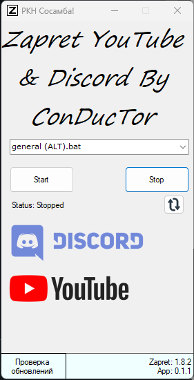
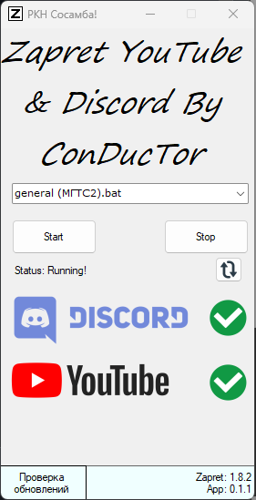

# ZapretUI - GUI для обхода блокировок Discord и YouTube

## Описание

ZapretUI - это графическая оболочка для скриптов [zapret-discord-youtube](https://github.com/Flowseal/zapret-discord-youtube) от Flowseal, предназначенная для удобного обхода блокировок сервисов Discord и YouTube.

## Основные функции

- 🚀 Запуск различных методов обхода блокировок (через BAT-скрипты)
- 🔍 Автоматическая проверка доступности YouTube и Discord
- 🔄 Автоматическое обновление (как скриптов обхода, так и самой GUI)
- 📊 Визуализация статуса соединения (галочки/крестики)
- 📌 Работа в трее с возможностью быстрого восстановления окна
- ⏱️ Управление сервисами (старт/стоп/перезапуск)

## Установка и требования

**Требования:**
- ОС Windows 10/11 (другие версии не тестировались)
- Отсутствие кириллицы в пути к программе

**Установка:**
1. Скачайте последнюю версию ZapretUI
2. Поместите исполняемый файл в папку назначения (без кириллицы в пути)
3. При первом запуске программа запросит разрешение на скачивание скриптов Flowseal

## Использование

1. Выберите нужный метод обхода из выпадающего списка
2. Нажмите "Start" для запуска
3. Статус соединения отобразится в интерфейсе
4. Для остановки используйте кнопку "Stop"

## Скриншоты

| Главное окно | Статус работы |
|--------------|---------------|
|  |  |

## Благодарности

Проект использует скрипты:
- [zapret-discord-youtube](https://github.com/Flowseal/zapret-discord-youtube) от [Flowseal](https://github.com/Flowseal)

## Лицензия

MIT License

## Поддержка и багрепорты

При возникновении проблем или предложений по улучшению:
- Telegram: [@ConDucTorLeha](https://t.me/ConDucTorLeha)
